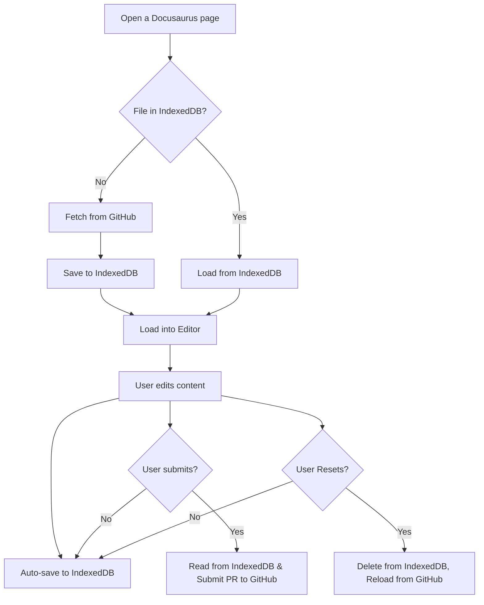
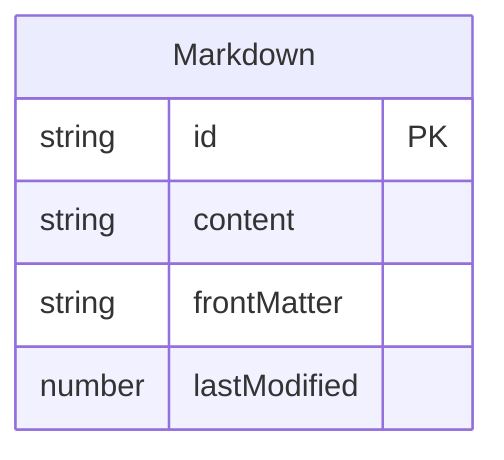

# Content Synchronization with IndexedDB

This plugin uses the browser’s **IndexedDB** to provide local persistence for Markdown files. This ensures that user changes are not lost if the page reloads or the network connection is interrupted.

## How It Works

### Step 1. Load

When a doc page is opened for editing, the plugin first tries to load the Markdown file from IndexedDB.

- If found, it uses the locally saved version.
- If not found, it fetches the latest version from GitHub and stores it in IndexedDB.

### Step 2. Edit

As you make changes in the editor, the content is **auto-saved** to IndexedDB on every change (debounced).

### Step 3. Submit

When you submit your changes, the content is read from IndexedDB and sent to GitHub as a pull request.

### Step 4. Reset

If you reset the page, the local IndexedDB entry is deleted and the original content is reloaded from GitHub.

## IndexedDB schema

