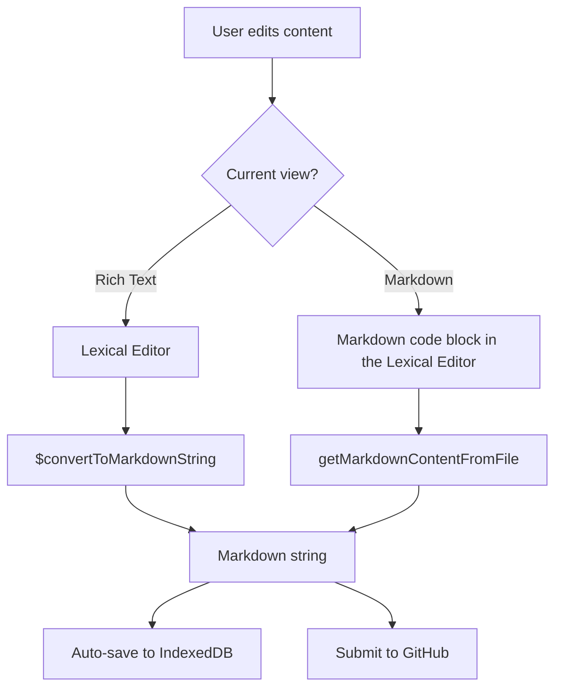

# Markdown Processing

This plugin has several ways of displaying and processing markdown content in the Docusaurus WYSIWYG editor. It supports both rich text and markdown views, allowing users to edit content in a familiar format while leveraging the power of Lexical for rich text editing.



## How it works

### Step 1. Parsing Markdown to Editor State

- When a markdown file is loaded, its content is parsed into Lexical's editor state using:
  ```ts
  $convertFromMarkdownString(markdownFile.content, WYSIWYG_TRANSFORMERS);
  ```
- This allows the editor to display the content as rich text, including support for lists, admonitions, equations, images, and more.

### Step 2. Markdown Transformers

- Transformers are defined in [`src/theme/plugins/MarkdownTransformers/index.ts`](../src/theme/plugins/MarkdownTransformers/index.ts).
- They handle:
  - **Block elements:** lists, code blocks, admonitions, tables, etc.
  - **Inline elements:** bold, italic, links, strikethrough, equations, etc.
- Each transformer defines how to **import** (parse) and **export** (serialize) its markdown representation.

### Step 3. Switching Views

- **Rich Text View:**
  - The editor displays the parsed Lexical state.
  - On save or submit, the state is converted back to markdown using:
    ```ts
    $convertToMarkdownString(WYSIWYG_TRANSFORMERS);
    ```
- **Markdown View:**
  - The editor displays a code block containing the raw markdown.
  - When switching back to rich text, the markdown is parsed again into Lexical state.

### Step 4. Auto-Save and Synchronization

- The [`AutoSavePlugin`](../src/theme/plugins/AutoSavePlugin/index.tsx) listens for changes and saves the current markdown to IndexedDB.
- If in markdown view, only the content inside the code block is saved (using [`getMarkdownContentFromFile`](../src/utils/stringHelper.ts)).
- On submit, the markdown is read from IndexedDB, optionally combined with front matter, and sent to GitHub.
