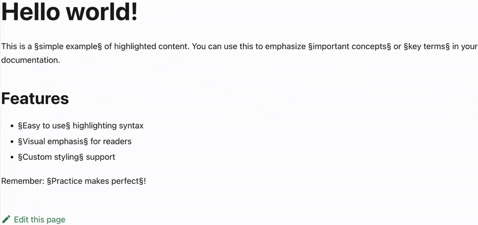

# Custom Transformer Tutorial

Learn to create a custom transformer that converts `§text§` syntax into yellow-highlighted text in your WYSIWYG editor.

## What You'll Learn

By the end of this tutorial, you'll understand:

- Which regex patterns to define for markdown transformation
- How to implement export and replace functions
- How to register custom transformers in the plugin

## What you'll build

A highlight transformer that converts `§important text§` into visually highlighted content.



_Watch how typing `§text§` automatically creates highlighted content!_

## Prerequisites

- Basic TypeScript and [regex](https://developer.mozilla.org/docs/Web/JavaScript/Guide/Regular_expressions) knowledge
- Understanding of [Lexical's transformer API](https://lexical.dev/docs/packages/lexical-markdown)
- This editor plugin integrated within a Docusaurus project

## Step 1: Define regex patterns

Create patterns that match your highlight syntax:

```ts title="src/theme/theme-utils/regExp.ts"
// Matches all §text§ patterns when importing markdown
export const HIGHLIGHT_IMPORT_REGEX = /§([^§]+)§/;

// Matches §text§ only at the end while typing
export const HIGHLIGHT_INPUT_REGEX = /§([^§]+)§$/;
```

**Why two patterns?**

- `importRegExp`: Finds all highlights when loading markdown (no `/g` flag needed - Lexical handles iteration)
- `regExp` with `$` anchor: Triggers only when you finish typing the complete pattern

## Step 2: Implement export function

Define how highlighted text becomes markdown:

```ts title="src/theme/plugins/MarkdownTransformers/myTransformers.ts"
import { $isTextNode, LexicalNode } from "lexical";

function highlightExport(node: LexicalNode): string | null {
  if (!$isTextNode(node)) {
    return null;
  }

  return node.hasFormat("highlight") ? `§${node.getTextContent()}§` : null;
}
```

This function checks if a text node has the 'highlight' format and converts it back to `§text§` markdown syntax.

## Step 3: Implement replace function

Define how markdown becomes highlighted editor content:

```ts title="src/theme/plugins/MarkdownTransformers/myTransformers.ts"
import { $createTextNode, $getSelection, $isRangeSelection } from "lexical";

function highlightReplace(textNode: TextNode, match: RegExpMatchArray) {
  const [, content] = match;

  const highlightedTextNode = $createTextNode(content);
  highlightedTextNode.setFormat("highlight");
  textNode.replace(highlightedTextNode);

  const selection = $getSelection();
  if ($isRangeSelection(selection)) {
    selection.insertText("");
  }
}
```

This function creates a text node with highlight formatting and manages cursor positioning.

## Step 4: Create the transformer

Combine all pieces into your transformer:

```ts title="src/theme/plugins/MarkdownTransformers/myTransformers.ts"
import { TextNode } from "lexical";
import { TextMatchTransformer } from "@lexical/markdown";

import {
  HIGHLIGHT_IMPORT_REGEX,
  HIGHLIGHT_INPUT_REGEX,
} from "../../theme-utils/regExp";

export const HIGHLIGHT: TextMatchTransformer = {
  dependencies: [TextNode],
  export: (node) => {
    return highlightExport(node);
  },
  importRegExp: HIGHLIGHT_IMPORT_REGEX,
  regExp: HIGHLIGHT_INPUT_REGEX,
  replace: (textNode, match) => {
    highlightReplace(textNode, match);
  },
  trigger: "§",
  type: "text-match",
};
```

## Step 5: Register the transformer

Add your transformer to the plugin:

```ts title="src/theme/plugins/MarkdownTransformers/index.ts"
import { TRANSFORMERS, Transformer } from "@lexical/markdown";
import { HIGHLIGHT } from "./myTransformers";

export const MY_TRANSFORMERS: Array<Transformer> = [...TRANSFORMERS, HIGHLIGHT];
```

## Final Code

Now, check you have the following code:

```ts title="src/theme/utils/regExp.ts"
export const HIGHLIGHT_IMPORT_REGEX = /§([^§]+)§/;
export const HIGHLIGHT_INPUT_REGEX = /§([^§]+)§$/;
```

```ts title="src/theme/plugins/MarkdownTransformers/myTransformers.ts"
import {
  $createTextNode,
  $getSelection,
  $isRangeSelection,
  $isTextNode,
  LexicalNode,
  TextNode,
} from "lexical";
import { TextMatchTransformer } from "@lexical/markdown";

import {
  HIGHLIGHT_IMPORT_REGEX,
  HIGHLIGHT_INPUT_REGEX,
} from "../../theme-utils/regExp";

function highlightExport(node: LexicalNode): string | null {
  if (!$isTextNode(node)) {
    return null;
  }

  return node.hasFormat("highlight") ? `§${node.getTextContent()}§` : null;
}

function highlightReplace(textNode: TextNode, match: RegExpMatchArray) {
  const [, content] = match;

  const highlightedTextNode = $createTextNode(content);
  highlightedTextNode.setFormat("highlight");
  textNode.replace(highlightedTextNode);

  const selection = $getSelection();
  if ($isRangeSelection(selection)) {
    selection.insertText("");
  }
}

export const HIGHLIGHT: TextMatchTransformer = {
  dependencies: [TextNode],
  export: (node) => {
    return highlightExport(node);
  },
  importRegExp: HIGHLIGHT_IMPORT_REGEX,
  regExp: HIGHLIGHT_INPUT_REGEX,
  replace: (textNode, match) => {
    highlightReplace(textNode, match);
  },
  trigger: "§",
  type: "text-match",
};
```

```ts title="src/theme/plugins/MarkdownTransformers/index.ts"
import { TRANSFORMERS, Transformer } from "@lexical/markdown";
import { HIGHLIGHT } from "./myTransformers";

export const MY_TRANSFORMERS: Array<Transformer> = [...TRANSFORMERS, HIGHLIGHT];
```

## Test it

1. Start your dev server
2. Type `§some text§` in the editor
3. Watch it transform into highlighted text

🎉 You've created a custom transformer that converts `§some text§` into highlighted content and back to markdown.

## Learn More

- [Lexical Transformer API Reference](https://lexical.dev/docs/packages/lexical-markdown)
